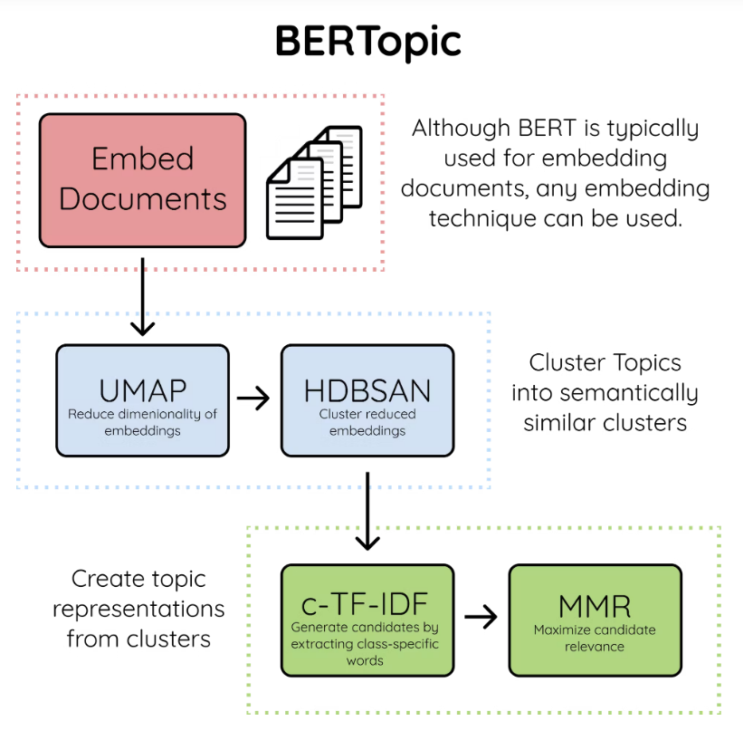
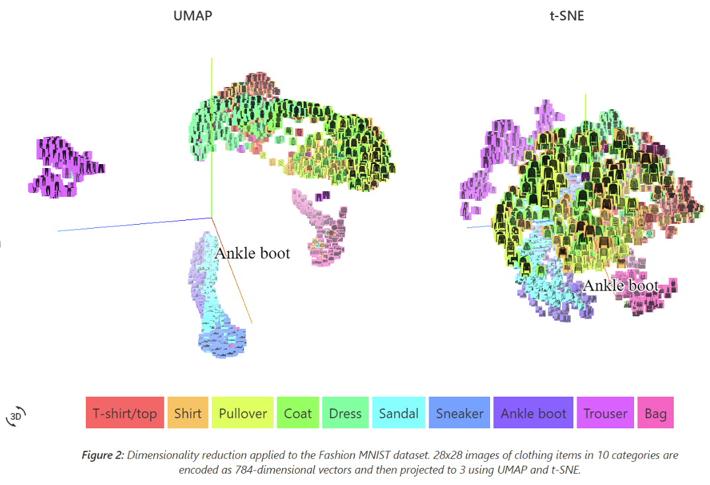

BertTopic
****************************

Introduction
______________

BERTopic is a topic modeling technique that leverages BERT embeddings and a class-based TF-IDF to create dense clusters allowing for easily interpretable topics whilst keeping important words in the topic descriptions.

There are four key components used in BERTopic, those are:

	* A transformer embedding model
	* UMAP dimensionality reduction
	* HDBSCAN clustering
	* Cluster tagging using c-TF-IDF

Transformer Embedding
------------------------
------------------------

* The first step is to embed documents into dimensional vectors.
* BERTopic supports several libraries (Sentence Transformers, Flair, SpaCy, Gensim, USE TF Hub) for encoding our text to dense vector embeddings. Of these, `Sentence Transformers`_ library provides the most extensive library of high-performing sentence embedding models. 
* As the name implies, this embedding model works best for either sentences or paragraphs. This means that whenever you have a set of documents, where each document contains several paragraphs, BERTopic will struggle to accurately extract a topic from that document. Several paragraphs typically means several topics and BERTopic will assign only one topic to a document. Therefore, it is advised to split up longer documents into either sentences or paragraphs before embedding them. That way, BERTopic will have a much easier job identifying topics in isolation.

* After building out embeddings, BERTopic compresses them into a lower-dimensional space. Thus, 384-dimensional vectors are transformed into two/three-dimensional vectors. To perform dimensionality reduction, we can use any of the popular choices such as `PCA`_, `tSNE`_, `UMAP`_, etc 

UMAP
+++++++

+ Flexible non-linear dimension reduction algorithm
+ Learns the manifold structure of the data and find a low dimensional embedding that preserves the essential topological structure of that manifold

HDBSCAN Clustering
+++++++++++++++++++++

#. `HDBSCAN`_ is used to cluster the (now)low-dimensional vectors
#. There are mainly two types of clustering methods:
	* Flat or Hierarchical: Focuses on whether there is (or is not) a hierarchy in the clustering method. For example, we may (ideally) view our graph hierarchy as moving from continents to countries to cities.

	.. image:: files/pics/BERTopic_HDBSCAN_flat_or_hierarchical_2.png

	* Centroid-based or Density-based: This means clustering based on proximity to a centroid or clustering based on the density of points. Centroid-based clustering is ideal for "spherical" clusters. Density-based clustering can handle more irregular shapes and identify outliers.

	.. image:: files/pics/BERTopic_Centroid_Density_cluster_2.png

.. _Sentence Transformers: https://www.pinecone.io/learn/sentence-embeddings/
.. _tSNE: https://medium.com/swlh/t-sne-explained-math-and-intuition-94599ab164cf
.. _PCA: https://towardsdatascience.com/principal-component-analysis-pca-explained-visually-with-zero-math-1cbf392b9e7d
.. _UMAP: https://pair-code.github.io/understanding-umap/
.. _HDBSCAN: https://pberba.github.io/stats/2020/07/08/intro-hdbscan/
