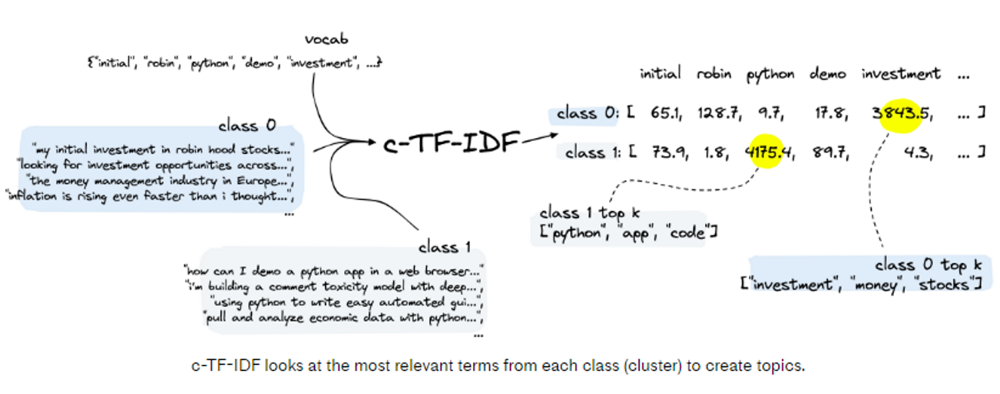
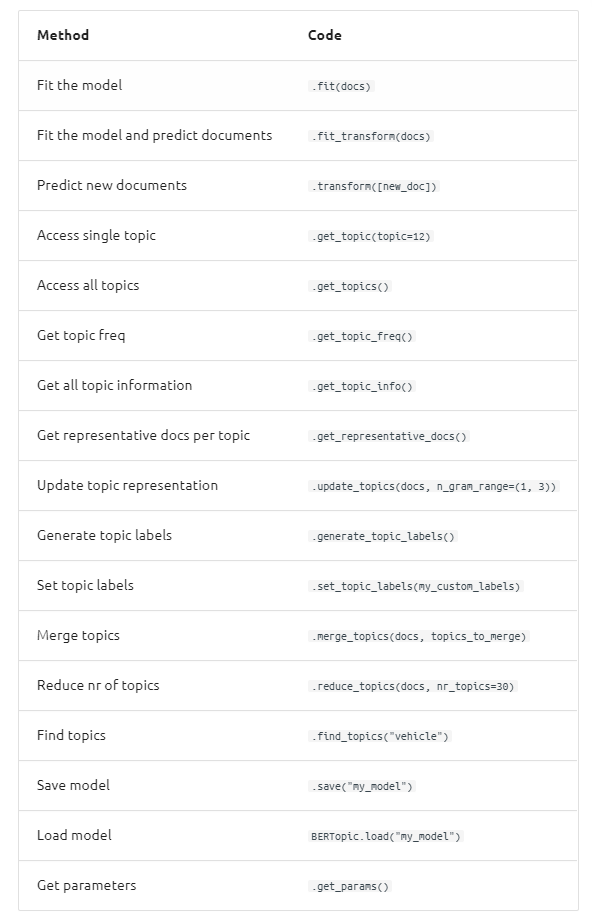
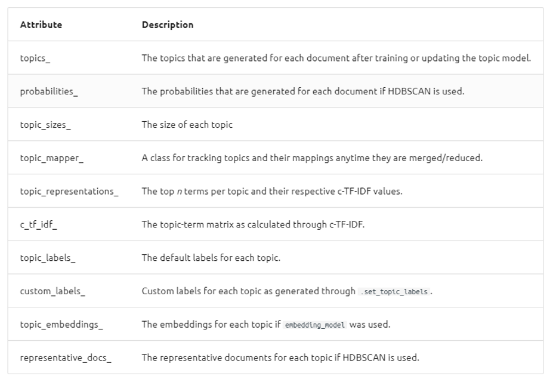

BertTopic
****************************

Introduction
------------------------
------------------------

BERTopic is a topic modeling technique that leverages BERT embeddings and a class-based TF-IDF to create dense clusters allowing for easily interpretable topics whilst keeping important words in the topic descriptions.

There are four key components used in BERTopic, those are:

	* A transformer embedding model
	* UMAP dimensionality reduction
	* HDBSCAN clustering
	* Cluster tagging using c-TF-IDF

.. image:: files/pics/BERTopic_overall_flowchart_2.png

Transformer Embedding
------------------------
------------------------

* The first step is to embed documents into dimensional vectors.
* BERTopic supports several libraries (Sentence Transformers, Flair, SpaCy, Gensim, USE TF Hub) for encoding our text to dense vector embeddings. Of these, `Sentence Transformers`_ library provides the most extensive library of high-performing sentence embedding models.
* As the name implies, this embedding model works best for either sentences or paragraphs. This means that whenever you have a set of documents, where each document contains several paragraphs, BERTopic will struggle to accurately extract a topic from that document. Several paragraphs typically means several topics and BERTopic will assign only one topic to a document. Therefore, it is advised to split up longer documents into either sentences or paragraphs before embedding them. That way, BERTopic will have a much easier job identifying topics in isolation.

* After building out embeddings, BERTopic compresses them into a lower-dimensional space. Thus, 384-dimensional vectors are transformed into two/three-dimensional vectors. To perform dimensionality reduction, we can use any of the popular choices such as `PCA`_, `tSNE`_, `UMAP`_, etc

UMAP
+++++++

+ Flexible non-linear dimension reduction algorithm
+ Learns the manifold structure of the data and find a low dimensional embedding that preserves the essential topological structure of that manifold

.. image:: files/pics/BERTopic_UMAP_3D_diagram_2.png

HDBSCAN Clustering
------------------------
------------------------

#. `HDBSCAN`_ is used to cluster the (now)low-dimensional vectors.

#. There are mainly two types of clustering methods:

	a) Flat or Hierarchical: Focuses on whether there is (or is not) a hierarchy in the clustering method. For example, we may (ideally) view our graph hierarchy as moving from continents to countries to cities.

	.. image:: files/pics/BERTopic_HDBSCAN_flat_or_hierarchical_2.png

	b) Centroid-based or Density-based: This means clustering based on proximity to a centroid or clustering based on the density of points. Centroid-based clustering is ideal for "spherical" clusters. Density-based clustering can handle more irregular shapes and identify outliers.

	.. image:: files/pics/BERTopic_Centroid_Density_cluster_2.png

#. HDBSCAN is a hierarchical, density-based method.
#. This means that we can benefit from the easier tuning and visualization of hierarchical data, handle irregular cluster shapes, and identify outliers.
#. HDBSCAN will identify and pick high-density regions, and eventually combine data points in these selected regions

	.. image:: files/pics/HDBSCAN_density_plot.png

.. _Sentence Transformers: https://www.pinecone.io/learn/sentence-embeddings/
.. _tSNE: https://medium.com/swlh/t-sne-explained-math-and-intuition-94599ab164cf
.. _PCA: https://towardsdatascience.com/principal-component-analysis-pca-explained-visually-with-zero-math-1cbf392b9e7d
.. _UMAP: https://pair-code.github.io/understanding-umap/
.. _HDBSCAN: https://pberba.github.io/stats/2020/07/08/intro-hdbscan/

Topic Extraction with c-TF-IDF
--------------------------------
--------------------------------

In the final step, BERTopic extracts topics for each of the clusters using a modified version on TF-IDF called c-TF-IDF.

`TF_IDF`_ is a popular technique for identifying the most relevant “documents” given a term or set of terms. c-TF-IDF turns this on its head by finding the most relevant terms given all of the “documents” within a cluster.

`Class Based TF_IDF`_: The goal of the class-based TF-IDF is to supply all documents within a single class with the same class vector. For this, we have to start looking at TF-IDF from a class-based point of view instead of individual documents. If documents are not individuals, but part of a larger collective, then it might be interesting to actually regard them as such by joining all documents in a class together.

.. _TF_IDF: https://medium.com/analytics-vidhya/tf-idf-term-frequency-technique-easiest-explanation-for-text-classification-in-nlp-with-code-8ca3912e58c3
.. _Class Based TF_IDF: https://maartengr.github.io/BERTopic/api/ctfidf.html

Once we pick the most relevant terms for each cluster to derive topics, we can improve the coherence of words with `Maximal Marginal Relevance`_

.. _Maximal Marginal Relevance: https://maartengr.github.io/BERTopic/api/mmr.html

Default Parameters
------------------------
------------------------

1) Below is an overview of common functions in BERTopic:

2) After having trained your BERTopic model, a number of attributes are saved within your model. These attributes, in part, refer to how model information is stored on an estimator during fitting. The attributes that you see below all end in _ and are public attributes that can be used to access model information.

Additional attributes can be found `here`_.

.. _here: https://maartengr.github.io/BERTopic/index.html#attributes

Model Execution
------------------------
------------------------

Listed below are the steps involved in executing the BERT out of box model.

1) Load the BERTopic model

.. code-block:: python

 		pip install bertopic

2) USAGE

The input documents will be loaded in as a list of strings. The steps are straightforward. Load in the dataset and preprocess if needed( Remove stop words and convert to list). For smaller datasets, it is preferable to remove stopwords.

.. code-block:: python
	 :linenos:

		from datasets import load_dataset
		from sklearn.feature_extraction.text import CountVectorizer

		data = load_dataset('jamescalam/reddit-python', split='train')

		# we add this to remove stopwords, for lower volumes of data stopwords can cause issues
		vectorizer_model = CountVectorizer(ngram_range=(1, 2), stop_words="english")

		# deal with df if needed
		if type(data['selftext']) is list:
    	text = data['selftext']
		else:
    	text = data['selftext'].tolist()

		model = BERTopic(
    vectorizer_model=vectorizer_model,
    language='english', calculate_probabilities=True,
    verbose=True)
		topics, probs = model.fit_transform(text)

The outputs generated by fitting the model are the topics and probabilities. The topic value simply represents the topic it is assigned to and the probability is the likelihood of a document falling into any of the possible topics.

.. code-block:: python

		freq = model.get_topic_info()
		freq.head(10)

3) Visualize

This command shows the intertopic distance map between the topics that were generated in the BERTopic Model.

.. code-block:: python

		model.visualize_topics()
		

Model Evaluation
------------------------
------------------------
