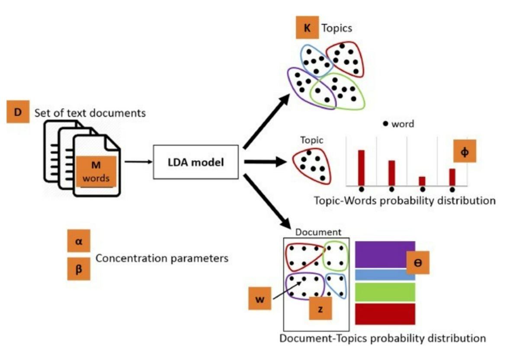
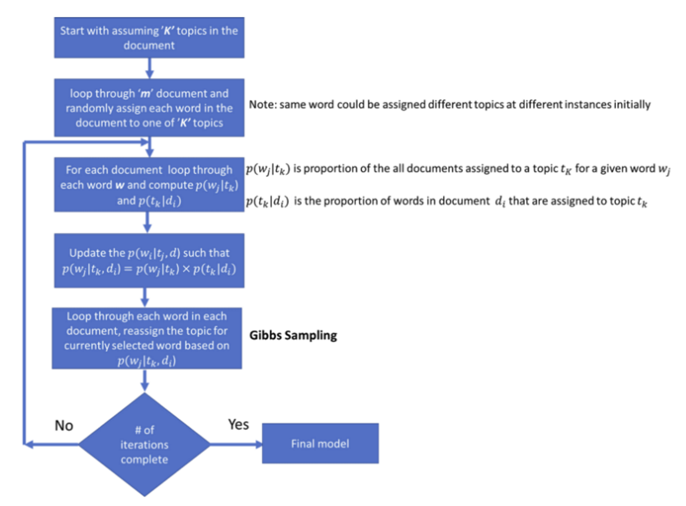

****************************
Latent Dirichlet Allocation
****************************

Introduction
_____________

a) **Latent**: Latent refers to anything that is 'hidden' in the data. In this technique, the topics within the document are not known, but it is assumed that they are present since the text is generated based on the topics.

b) **Dirichlet**: Dirichlet is a distribution of distributions.Let's say we have a machine that produces dice and each dice will have 6 unbiased sides. Additionally, we can control whether a machine will produce a dice. In this scenario, the machine producing dice is considered as a distribution since it can produce different types of dice. The dice itself would be a distribution as each dice has 6 possible face values. This is a case of Dirichlet distribution or a 'distribution of distributions'.

c) **Allocation**: Once we have a Dirichlet distribution, we allocate topics to documents and words of the document to topics.

Assumptions
_____________

#. LDA assumes that every chunk of text/document fed into it has words associated with each other.
#. It also assumes documents are produced from a mixture of topics. These topics then generate words  
   based on their probability distribution.

Default Parameters
___________________

* **Document-topic density factor (‘α’)**
	The ‘α’ hyperparameter determines how many topics would exist in the document corpus. A low value of ‘α’ would mean fewer topics in the document mix and vice versa
	Also known as the concentration parameter, following are the possible types of ‘α’ distribution:
		- Uniform (α =1)
		- Concentrated (α > 1)
		- Sparse (α < 1)

* **Topic-word density factor (‘β’)**
    The ‘β’ hyperparameter determines how many words are distributed to each topic. Topics with lower value of ‘β’ will have fewer words and vice versa. Like α, β can take values between 0 and 1.

* **Number of topics to be considered (K)**
    K is usually assigned a value based on domain expertise.

Algorithm Explained
___________________

*Step-1*:
Go through each of the documents in a corpus and randomly assign each word in the document to one of K topics (K is chosen beforehand or given by the user).

*Step-2*:
With the help of random assignment, we got the topic representations for all the documents and word distributions of all the topics, but these are not very good ones.

*Step-3*:
To improve on this random assignment, for each document d, we go through each word w and compute the following:

   **P (topic t | document d)**: represents the proportion of words present in document d that are assigned to topic t of the corpus.

   **P (word w | topic t)**: represents the proportion of assignments to topic t, over all documents d, that comes from word w.

*Step-4*:
Reassign word w a new topic t’, where we choose topic t’ with probability p(topic t’ | document d)* p(word w | topic t’).
This generative model predicts the probability that topic t’ generate word w.

*Step-5*:
Repeating Step-4 a large number of times, up to we reach a steady-state and at that state the topic assignments are pretty good. And finally, we use these assignments to determine the topic mixtures of each document.

*Step-6*:
After completing a certain number of iterations, we achieved a steady state where the document topic and topic term distributions are fairly good. And this becomes the convergence point of LDA.

 

   

Model Execution
___________________

**Data Transformation**

The two main inputs to the LDA topic model are the dictionary(id2word) and the corpus.

* **Corpus**: Set of documents

* **Dictionary**: Set of words in all the documents

* *Step 1*: Import the library

.. code-block:: python

    import gensim.corpora as corpora

* *Step 2*: Create dictionary and corpus using the lemmatized data

.. code-block:: python

    id2word = corpora.Dictionary(data_lemmatized)       # Dictionary

    texts = data_lemmatized     # Corpus

* *Step 3*: Create the Term Document Frequency 

.. code-block:: python

    corpus = [id2word.doc2bow(text) for text in texts]

Gensim creates a unique id for each word in the document. The corpus produced above is a mapping of (word_id, word_frequency). For example, (0, 7) above implies, word id 0 occurs 7 times.

**Base Model**

* **corpus** is the set of documents (derived in the previous step)

* **id2word** is the dictionary (derived in the previous step)

* **num_topics** is the number of topics

* **chunksize** controls how many documents are processed at a time in the training algorithm. Increasing chunksize will speed up training, at least as long as the chunk of documents easily fit into memory

* **passes** controls how often we train the model on the entire corpus (set to 10). Another word for passes might be “epochs”. iterations is somewhat technical, but essentially it controls how often we repeat a particular loop over each document. It is important to set the number of “passes” and “iterations” high enough 

.. code-block:: python

    # Build LDA model
    lda_model = gensim.models.LdaMulticore(corpus=corpus,
                                           id2word=id2word,
                                           num_topics=10, 
                                           random_state=100,
                                           chunksize=100,
                                           passes=10,
                                           per_word_topics=True)

 

Model Evaluation Metrics
_________________________

**Coherence Measures**

#. *C_v measure* is based on a sliding window, one-set segmentation of the top words and an indirect confirmation measure that uses normalized pointwise mutual information (NPMI) and the cosine similarity
#. *C_p* is based on a sliding window, one-preceding segmentation of the top words and the confirmation measure of Fitelson’s coherence
#. *C_uci* measure is based on a sliding window and the pointwise mutual information (PMI) of all word pairs of the given top words
#. *C_umass* is based on document cooccurrence counts, a one-preceding segmentation and a logarithmic conditional probability as confirmation measure
#. *C_npmi* is an enhanced version of the C_uci coherence using the normalized pointwise mutual information (NPMI)
#. *C_a* is baseed on a context window, a pairwise comparison of the top words and an indirect confirmation measure that uses normalized pointwise mutual information (NPMI) and the cosine similarity

.. code-block:: python

    from gensim.models import CoherenceModel
    # Compute Coherence Score
    coherence_model_lda = CoherenceModel(model=lda_model, texts=data_lemmatized, dictionary=id2word, coherence='c_v')
    coherence_lda = coherence_model_lda.get_coherence()

Disadvantages
___________________

* *LDA results may not be robust* - Documents with identical wording may be stated as having wildly different topical content. Since LDA results are probabilistic, we wouldn’t necessarily expect identically-worded documents to have the exact same topical distributions. In the event that this happens, it becomes difficult to differentiate between such documents. 

* *LDA results may not be explicable* - The results of an LDA give probability distributions for the topics over the vocabulary. In order to understand what each topic is about 'semantically', we can list the words in order of decreasing probability, and look at the top j words per topic for some j. Thus, we are looking at a list of words that is somehow representative of this topic. But these words typically don’t fit together in an easily-comprehensible way. We don’t usually get a list like:

    - Topic x: banana, orange, grapefruit, peel, vitamin, five, watermelon.
     
  Thus, we need to strongly rely on guess-work to find the best possible semantically appropriate topic for a set of its top words.

